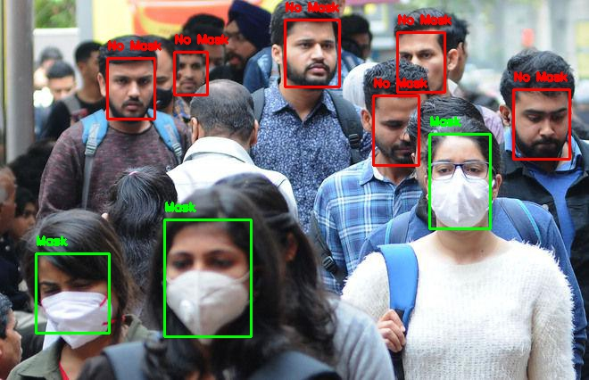

# Face Mask Detector
 This project is developed considering the amid second wave of coronavirus in india. Second wave has hit the country very badly, The number of active cases are increasing rapidly and death rate has also increased. 
Viewing this situation, It has become very important to take precautions of wearing face mask, frequent sanitization and social distancing to protect ourselves and our loved ones from this lethal virus.
Health Organsations, Government, News channels, everyone are stressing on wearing a mask whenever going out. This is the first important thing we have to do to stop the virus chain and prevent it from harming us.

So, This project is a web application developed using streamlit library which aims at detecting the people not wearing a mask. A Face Mask Classifier model (ResNet50) is trained and deployed for identifying people not wearing a face mask. For aiding the training process, augmented masked faces are generated (using facial landmarks) and blurring effects are also imitated.

**This app is deployed on online streamlit sharing**

**Face Mask Detector** 

## Getting Started

### Prerequisites
Running this project on your local system requires the following packages to be installed :

* numpy
* matplotlib
* sklearn
* PIL
* cv2
* keras
* tensorflow
* streamlit
* streamlit web_rtc

## Project Description and Results

## Face Detection
res10 caffe model is used for extracting the face features using blobs.Caffe is a deep learning framework which has good speed and efficiency. Common Face Detectors such as the Haar-Cascades or the MTCNN are not efficient in this particular use-case as they are not able to detect faces that are covered or have low-resolution.

## Face Mask Classifier
A slighly modified ResNet50 model (with base layers pretrained on imagenet) is used for classifying whether a face is masked properly or not. Combination of some AveragePooling2D and Dense (with dropout) layers ending with a Sigmoid or Softmax classifier is appended on top of the base layers. Different architectures can be used for the purpose, however complex ones should be avoided to reduce overfitting.

This dataset consists of 4095 images belonging to two classes:

* with_mask: 
2165 images
* without_mask: 
1930 images

For this classifier to work properly in all conditions, we need a diverse dataset that contains faces in various orientations and lighting conditions. For better results, our dataset should also cover people of different ages and gender. Finding such wide range of pictures having people wearing a face mask becomes a challenging task. Thus we need to apply numerous kinds of Augmentation before we start the training process.

## Streamlit App
This project is created using the modern python library called streamlit, which is used for creating python web application and deploying the model.

## Results

 <strong>Input Image</strong>
  
 

 <strong>Output Image</strong>
 

 
 
 **Note:** *streamlit web_rtc framework which is used to connect the webcam doesn't work on private network(WIFI), It only works on ethernet and mobile data.*
 
 **Streamlit web_rtc works completely fine on local server.**

 
 
 
 ## Future Work
* Working on including social distancing violation model
* Speed Optimization
* Face Mask Classification for Side Views

If you have any new ideas or suggestions to improve this project, feel free to contact me. Your valuable feedback is highly appreciated!

Artificial Intelligence has sure come a long way in solving such real world problems. Hoping that it helps the world overcome the COVID-19 situation, so we can party again, hold our glasses high, and say Cheers!

## Final Notes
**Thanks for going through this Repository! Have a nice day.** 
 **Got any Queries? Feel free to contact me.** 
 **Mohammed Zeeshaan**

 

